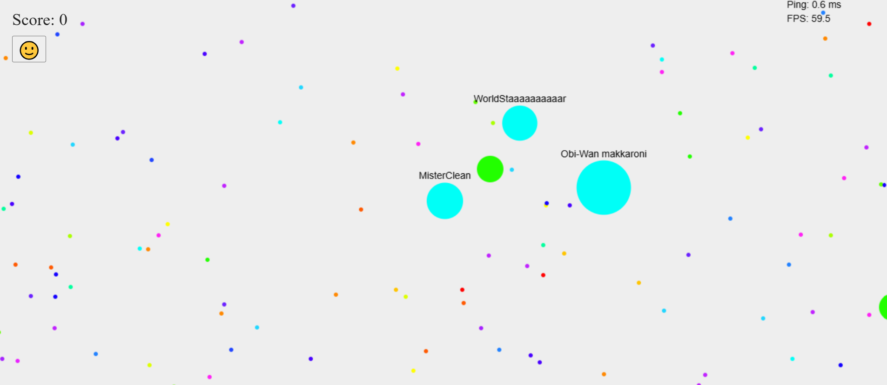
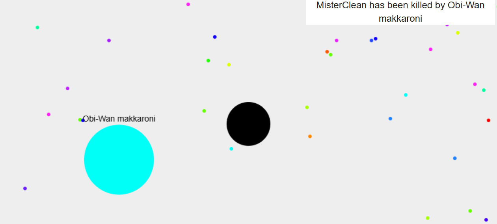

# Marsik.io

This is a small multiplayer browser game  based on canvas, where players collect colorful dots, chase and eat other players, shoot bullets, and dynamically grow or shrink. The goal is to survive and become the biggest player on the map.

 
 

## Features

- Real-time multiplayer via WebSockets
- Player size changes dynamically based on collected points
- Different types of characters:
  - Normal dots
  - Yummies (green balls): You grow a lot if you eat them, but they can also explode and beat your ass
  - Black holes: They can cover you from incoming bullets but if you fall inside of them, you get destroyed
- Shoot bullets at other players
- Send funny and pretty Smileys to other players
- Automatic zoom-out as players grow
- FPS and ping display for performance monitoring

## Controls

- **Click**: Move your player 
- **click on player**: Stop  
- **Enter**: Shoot

## Setup

1. Clone the repository
2. Install node.js: npm install
3. Start the server: node server.js
4. Go to http://localhost:3000 and play

## Game is at an early stage
You can expect:
- Further rendering optimizations
- More customized and extremely intensive smileys
- Bug fixes as they occur
- Additional game features, e.g., enemy bots
- Special items that give extra power when collected
- A bigger map
- More precise collision detection
- Eventually, web deployment so everyone can play

